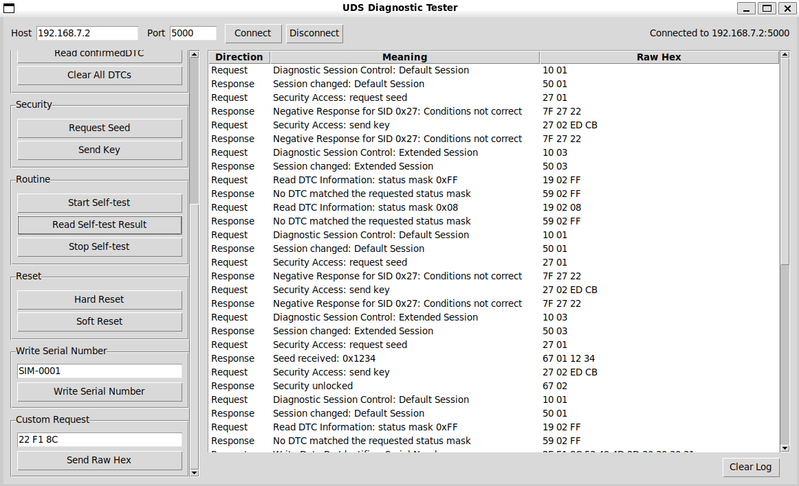

# Embedded Linux UDS Diagnostic ECU Simulator

Classic AUTOSAR의 DCM(Diagnostic Communication Manager) 구조를 참고하여 만든
TCP 기반 UDS Diagnostic ECU 시뮬레이터입니다.

현재는 호스트 Linux/WSL에서 `diagnosticd`를 직접 실행해 테스트할 수 있고,
Yocto QEMU 이미지에 포함하기 위한 `meta-diagnostic` 레이어와 systemd 서비스
구성까지 포함되어 있습니다.

---

## 프로젝트 목표

* Yocto Build System 이해
* Recipe(.bb) 작성
* Custom Layer 생성
* systemd Service 등록
* Embedded Linux Application 개발
* Linux Daemon 구조 이해
* UDS Protocol 구현
* AUTOSAR DCM 구조를 Linux 환경에 적용

---

## Quick Start
- clone this repository
- read document `Development_Environment.md` to install
- install all dependancy
- `runqemu diagnostic-image`
- `./tools/uds_gui.py` or type `nc 127.0.0.1 5000` in qemu cmd line
- enjoy UDS Simulate

## QEMU Test Example


## Tester GUI Test Example


---

## 구현된 UDS 서비스

| SID | 서비스 | 현재 동작 |
| --- | --- | --- |
| `0x10` | Diagnostic Session Control | Default Session(`0x01`), Extended Session(`0x03`) 지원 |
| `0x11` | ECU Reset | Hard Reset(`0x01`), Soft Reset(`0x03`) 시뮬레이션. 세션을 Default로 복귀 |
| `0x14` | ClearDiagnosticInformation | Extended Session에서 전체 DTC 그룹(`FF FF FF`) 삭제 지원 |
| `0x19` | ReadDTCInformation | `reportDTCByStatusMask(0x02)` 지원. status mask에 맞는 저장 DTC 반환 |
| `0x22` | ReadDataByIdentifier | 등록된 DID 값 읽기 |
| `0x27` | SecurityAccess | Extended Session에서 seed(`0x01`) 요청, key(`0x02`) 전송 지원 |
| `0x2E` | WriteDataByIdentifier | Extended Session에서만 등록된 DID 값 쓰기 |
| `0x31` | RoutineControl | SecurityAccess 성공 후 self-test routine `0xFF00` 시작/중지/결과 조회 지원 |

지원하지 않는 SID는 negative response `7F <SID> 11`을 반환합니다.

SecurityAccess 데모 seed는 `12 34`이고 key는 각 byte를 `0xFF`와 XOR한 `ED CB`입니다.

---

## 기본 DID

| DID | 내용 | 기본값 |
| --- | --- | --- |
| `F190` | VIN | `config/diagnostic.conf`의 `VIN` |
| `F187` | SW Version | `SW-1.0.0` |
| `F188` | HW Version | `HW-QEMU-X86_64` |
| `F18C` | Serial Number | `SIM-0001` |

등록되지 않은 DID 읽기/쓰기는 negative response `7F <SID> 31`을 반환합니다.

---

## 예시 요청

```bash
# VIN 읽기
printf '22 F1 90\n' | nc 127.0.0.1 5000

# Extended Session 진입
printf '10 03\n' | nc 127.0.0.1 5000

# 같은 연결에서 Serial Number 쓰기 후 읽기
printf '10 03\n2E F1 8C 41 42 43\n22 F1 8C\n' | nc 127.0.0.1 5000

# ECU Reset 시뮬레이션
printf '11 01\n' | nc 127.0.0.1 5000

# DTC 읽기
printf '19 02 FF\n' | nc 127.0.0.1 5000

# confirmedDTC(status 0x08)만 읽기
printf '19 02 08\n' | nc 127.0.0.1 5000

# Extended Session에서 전체 DTC 삭제 후 다시 읽기
printf '10 03\n14 FF FF FF\n19 02 FF\n' | nc 127.0.0.1 5000

# SecurityAccess 후 self-test routine 시작/결과 조회/중지
printf '10 03\n27 01\n27 02 ED CB\n31 01 FF 00\n31 03 FF 00\n31 02 FF 00\n' | nc 127.0.0.1 5000
```
---

## 개발 환경

| 항목 | 내용 |
| --- | --- |
| Host | Windows 11, WSL2 Ubuntu |
| Target | Yocto Project, QEMU, Embedded Linux |
| Language | C++17 |
| Build | CMake |
| Service Manager | systemd |

---

## 전체 구조

```text
                +----------------------+
                |     Tester(Client)   |
                +----------+-----------+
                           |
                        TCP Socket
                           |
                +----------v-----------+
                |  Diagnostic Daemon  |
                +----------+-----------+
                           |
        +------------------+------------------+
        |                  |                  |
        |                  |                  |
  Transport         UDS Dispatcher      Logger
        |                  |
        |                  |
        |           +------+------+
        |           |             |
        |       DID Manager   Session Manager
        |                         |
        +-------------------------+
```

---

## 디렉터리 구조

```text
Yocto_UDS_Simulator/
├── app/
│   ├── main.cpp
│   ├── DiagnosticServer.cpp
│   ├── TcpServer.cpp
│   ├── UdsDispatcher.cpp
│   ├── DidManager.cpp
│   ├── SessionManager.cpp
│   └── Logger.cpp
├── include/
├── config/
│   └── diagnostic.conf
├── systemd/
│   └── diagnostic.service
├── yocto/
│   └── meta-diagnostic/
│       ├── conf/layer.conf
│       ├── recipes-app/diagnostic/diagnostic.bb
│       └── recipes-core/images/diagnostic-image.bb
├── CMakeLists.txt
└── README.md
```

---

## 호스트에서 빌드 및 실행

```bash
cd /home/seokjunkang/dev/Yocto_UDS_Simulator

cmake -S . -B build
cmake --build build
ctest --test-dir build --output-on-failure

./build/diagnosticd config/diagnostic.conf
```

기본 설정 파일은 `config/diagnostic.conf`입니다.

```ini
Port=5000
LogLevel=INFO
VIN=KMH00000000000000
```

서버가 실행되면 TCP `5000` 포트에서 Tester 연결을 기다립니다.

---

## 테스트 방법

요청은 한 줄에 hex byte를 공백으로 구분해서 보냅니다. 각 요청은 newline으로
끝나야 합니다.

```bash
printf '22 F1 90\n' | nc 127.0.0.1 5000
```

예상 응답:

```text
62 F1 90 4B 4D 48 30 30 30 30 30 30 30 30 30 30 30 30 30 30
```

전용 Tester 클라이언트도 사용할 수 있습니다.

```bash
tools/uds_tester.py
uds> 10 03
uds> 14 FF FF FF
uds> 19 02 FF
uds> quit
```

GUI Tester는 UDS 서비스를 자연어 버튼과 해석된 응답으로 보여줍니다.

```bash
tools/uds_gui.py
```

예를 들어 `Enter Extended Session`, `Read All DTCs`, `Clear All DTCs` 버튼을
누르면 요청/응답 의미와 raw hex가 함께 기록됩니다.

세션 상태는 같은 TCP 연결 안에서 유지됩니다. `WriteDataByIdentifier`는
Extended Session에서만 허용되므로, 아래처럼 같은 연결에서 먼저 `10 03`을
보내야 합니다.

```bash
printf '10 03\n2E F1 8C 41 42 43\n22 F1 8C\n' | nc 127.0.0.1 5000
```

예상 응답:

```text
50 03
6E F1 8C
62 F1 8C 41 42 43
```

---

## Yocto 구성

Yocto 레이어는 `yocto/meta-diagnostic`에 있습니다.

```text
meta-diagnostic/
├── conf/layer.conf
├── recipes-app/diagnostic/diagnostic.bb
└── recipes-core/images/diagnostic-image.bb
```

`diagnostic.bb`는 `externalsrc`를 사용하여 현재 작업 디렉터리의 C++ 소스를
빌드합니다.

```bitbake
inherit cmake systemd externalsrc
EXTERNALSRC = "/home/seokjunkang/dev/Yocto_UDS_Simulator"
```

`diagnostic-image.bb`는 minimal image에 `diagnostic` 패키지를 포함합니다.

---

## Yocto 빌드 흐름

```bash
cd /home/seokjunkang/dev/poky
source oe-init-build-env

bitbake-layers add-layer /home/seokjunkang/dev/Yocto_UDS_Simulator/yocto/meta-diagnostic
bitbake diagnostic-image

runqemu diagnostic-image slirp nographic
# 위 명령어에서 qemu가 이미지를 찾지 못할 시 직접 디렉터리 입력하여 수행
runqemu tmp/deploy/images/qemux86-64/diagnostic-image-qemux86-64.rootfs.qemuboot.conf slirp nographic
```

부팅 후 systemd가 `diagnostic.service`를 통해 아래 명령을 실행합니다.

```bash
/usr/bin/diagnosticd /etc/diagnostic.conf
```

QEMU 안에서 서버 상태를 확인합니다.

```bash
systemctl status diagnostic
ss -ltnp | grep 5000
```

이 이미지의 `slirp` 네트워크 설정은 guest `5000`번 포트를 host
`127.0.0.1:5000`으로 포워딩합니다. 따라서 QEMU는 계속 켜둔 상태에서,
호스트 터미널을 하나 더 열고 Tester를 실행합니다.

```bash
tools/uds_tester.py --host 127.0.0.1 --port 5000
uds> 10 03
uds> 14 FF FF FF
```

GUI로 볼 수도 있습니다.

```bash
tools/uds_gui.py
```

포트 포워딩 없이 host에서 `127.0.0.1:5000`으로 보내면 QEMU guest가 아니라
host 자신의 5000번 포트로 접속합니다.

---

## 현재 상태

완료된 부분:

* C++17 기반 diagnostic daemon
* TCP server
* newline 기반 hex request/response 처리
* UDS Dispatcher
* DID Manager
* DTC Manager
* Session Manager
* Logger
* Config loader
* systemd unit
* CMake install rule
* Yocto `meta-diagnostic` layer
* Yocto application recipe
* Yocto custom image recipe
* 실제 Yocto `bitbake diagnostic-image` 빌드 검증
* Tester 전용 클라이언트 작성
* GUI Tester 작성
* 단위 테스트 추가
* 여러 클라이언트 동시 처리
